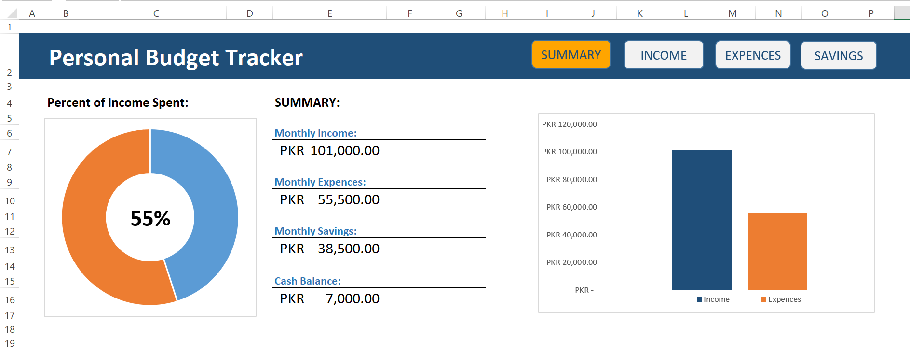

# 💰 Personal Budget Tracker – Excel Financial Dashboard

An interactive and automated Excel-based dashboard to efficiently track your **monthly income, expenses, savings**, and **cash balance**. This project provides a visual summary of your financial health using professional charts and formulas.

---

## 📊 Features

- 📌 Clean and professional layout
- 🟠 Donut Chart: Percent of income spent
- 🔵 Bar Chart: Income vs Expenses comparison
- 🧾 Summary Section:
  - Monthly Income
  - Monthly Expenses
  - Monthly Savings
  - Cash Balance
- 🧠 Formula-driven automatic calculations
- 💡 Easy to update and user-friendly tabs: `INCOME`, `EXPENSES`, `SAVINGS`, `SUMMARY`

---

## 🛠️ How to Use

1. Open the Excel file.
2. Go to the `INCOME`, `EXPENSES`, and `SAVINGS` tabs and enter your data.
3. Visit the `SUMMARY` tab to view real-time graphs and analysis.
4. All charts and summaries update automatically based on your input.

---

## 📁 Files Included

- `Personal_Budget_Tracker.xlsx` – Main Excel dashboard file
- `README.md` – Project documentation

---

## ✅ Software Requirements

- Microsoft Excel 2016 or later
- (Optional) Any spreadsheet viewer for read-only access

---

## 📷 Preview

---

## 📌 Author

**Shehreyar**  
📧 mshehreyar.garwan@gmail.com  

---

## 📄 License

This project is licensed under the MIT License – feel free to use and modify it.

---

